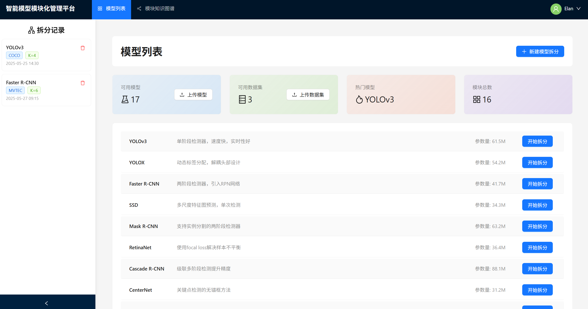

# 大模型模块化功能标注平台

## 项目简介

本项目用于对大型语言模型进行模块化拆分和功能标注，支持聚类拆分、热力图生成、语义标注与知识图谱构建。

---

# 🛠 Installation

The model partitioning and annotation platform is based on PyTorch and the OpenMMLab ecosystem.

## 1. Create Python Environment

```bash
conda create -n open-mmlab python=3.8 pytorch=2.1.0 cudatoolkit=11.8 torchvision -c pytorch -y
conda activate open-mmlab
```

## 2. Install Dependencies

```bash
pip install -r requirements.txt
```

Or, install key dependencies manually:

```bash
pip install torch==2.1.0
pip install mmcv==2.1.0
pip install mmdet==3.3.0
pip install mmengine-lite==0.10.7
pip install pandas==1.3.5
pip install numpy==1.21.6
```

> **Note:** The code requires `torch.fx` for computational graph extraction. Please ensure your PyTorch version is >=1.10.

## 3. Configure Neo4j

Set up a Neo4j database (version 5.25.1 recommended) and note the connection details for later use.

---

# 🚀 Getting Started

1. Model Partitioning and Feature Extraction

```bash
# Partition the model using clustering
python split/<Model_Name>.py \
  --data $Dataset_Path \
  --K $Num_Partitions      # default=3 \
  --n_init $Num_Initializations   # default=10 \
  --max_iter $Max_Iterations      # default=300

# Output: Partitioned results and feature files (.pkl) are saved in the /features directory
```

2. Heatmap Generation

```bash
# Generate a heatmap from a partitioned feature file
# Select a .pkl file from the /features directory
python <Model_Name>.py \
  --input features/<Model_Name>_features_k.pkl \
  --output heatmaps/<Model_Name>/modulex_laptop.jpg
```


3. Annotation

```bash
# Annotate the heatmap for functional labeling
python annotation/<Model_Name>.py \
  --input heatmaps/<Model_Name>/modulex_laptop.jpg \
  --output outputs/your_annotation.csv
```

4. Knowledge Graph Construction

```bash
# Import the annotation CSV into Neo4j to generate a knowledge graph
python neo4j/import.py \
  --csv outputs/your_annotation.csv \
  --neo4j-uri bolt://localhost:7687 \
  --user neo4j \
  --password your_password
```

---

## Platform Demo



